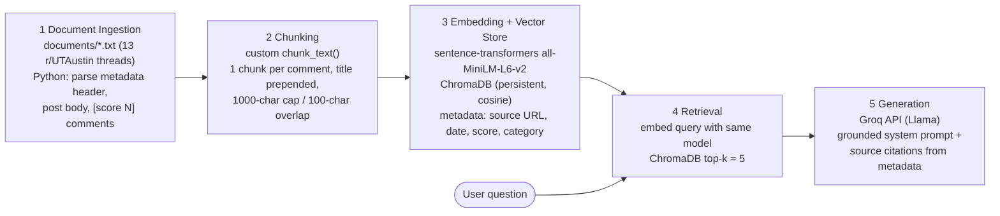

# Project 1 Planning: The Unofficial Guide

> Write this document before you write any pipeline code.
> Your spec and architecture diagram are what you'll use to direct AI tools (Claude, Copilot, etc.) to generate your implementation — the more specific they are, the more useful the generated code will be.
> Update the Retrieval Approach and Chunking Strategy sections if you change your approach during implementation.
> Update this file before starting any stretch features.

---

## Domain

<!-- What domain did you choose? Why is this knowledge valuable and hard to find through official channels? -->

**Off-campus housing experiences at UT Austin** — covering West Campus, Riverside, Hyde Park, and North Campus apartments, plus leasing timelines, pricing tradeoffs, and rental scams. This knowledge is valuable because apartment websites and leasing offices only show marketing material: they won't tell you which buildings have chronic maintenance problems, whether it's actually cheaper to live in Riverside with a car, or that signing a lease in October is usually a mistake. The real answers live scattered across years of r/UTAustin threads, where students share firsthand experiences that no official channel collects in one place.

---

## Documents

<!-- List your specific sources: URLs, subreddit names, forum threads, or file descriptions.
     Aim for at least 10 sources that together cover different subtopics or perspectives within your domain. -->

All sources are r/UTAustin threads (post + top comments), saved as plain-text files in `documents/` with a metadata header (title, source URL, post date, retrieval date, category) for source attribution. Retrieved 2026-06-11 via the pullpush.io Reddit archive.

| # | Source | Description | URL or location |
|---|--------|-------------|-----------------|
| 1 | r/UTAustin thread | West Campus studio/1bd recommendations — students compare buildings, prices, pros/cons | `documents/01_west-campus-studio-1bd-recs.txt` — https://www.reddit.com/r/UTAustin/comments/z9fu0r/ |
| 2 | r/UTAustin thread | Skyloft review — is it a good place to live, firsthand resident experiences | `documents/02_skyloft-review.txt` — https://www.reddit.com/r/UTAustin/comments/sr5c3c/ |
| 3 | r/UTAustin thread | 26 West — what residents wish they'd known before moving in | `documents/03_26-west-what-to-know.txt` — https://www.reddit.com/r/UTAustin/comments/1bgj6yl/ |
| 4 | r/UTAustin thread | Regents West on 26th — detailed negative review warning against signing a lease | `documents/04_regents-west-warning.txt` — https://www.reddit.com/r/UTAustin/comments/1iypq16/ |
| 5 | r/UTAustin thread | The Castilian — whether it's a good option for sophomores | `documents/05_castilian-sophomores.txt` — https://www.reddit.com/r/UTAustin/comments/t7hbqg/ |
| 6 | r/UTAustin thread | Cost comparison: Riverside with a car vs West Campus without one (bus options, parking fees) | `documents/06_riverside-car-vs-west-campus.txt` — https://www.reddit.com/r/UTAustin/comments/qz1kan/ |
| 7 | r/UTAustin thread | Finding housing in West Campus or Hyde Park under $850/month | `documents/07_west-campus-hyde-park-under-850.txt` — https://www.reddit.com/r/UTAustin/comments/kamglp/ |
| 8 | r/UTAustin thread | Broad housing guidance for incoming freshmen (dorms vs apartments, neighborhoods, timing) | `documents/08_freshman-housing-guidance.txt` — https://www.reddit.com/r/UTAustin/comments/180xpk0/ |
| 9 | r/UTAustin thread | Why students sign overpriced high-rise apartments in West Campus — pricing and tradeoff debate | `documents/09_overpriced-high-rises-west-campus.txt` — https://www.reddit.com/r/UTAustin/comments/wam3jy/ |
| 10 | r/UTAustin thread | Leasing timeline advice: why signing a lease too early costs you money | `documents/10_too-early-to-sign-lease.txt` — https://www.reddit.com/r/UTAustin/comments/kvcl8g/ |
| 11 | r/UTAustin thread | Is it necessary to sign a lease this early for next year? (recent take on lease timing) | `documents/11_sign-lease-early-necessary.txt` — https://www.reddit.com/r/UTAustin/comments/1fq7bbv/ |
| 12 | r/UTAustin thread | What to do during the gap between an old lease ending and a new one starting | `documents/12_gap-between-leases.txt` — https://www.reddit.com/r/UTAustin/comments/14irges/ |
| 13 | r/UTAustin thread | West Campus rental scam incident — how a student got scammed and warning signs | `documents/13_roommate-scammed-west-campus.txt` — https://www.reddit.com/r/UTAustin/comments/lx4uxh/ |

**Candidate questions this system should answer** (starting point for the Evaluation Plan):

1. What do students say about living at 26 West before moving in?
2. Is it cheaper to live in Riverside with a car or West Campus without one?
3. When should I sign a lease for the fall semester, and what happens if I sign too early?
4. What rental scams should I watch out for when looking for housing in West Campus?
5. Is the Castilian a good housing option for sophomores?

---

## Chunking Strategy

<!-- How will you split documents into chunks?
     State your chunk size (in tokens or characters), overlap size, and explain why those
     numbers fit the structure of your documents.
     A review-heavy corpus warrants different chunking than a long FAQ. -->

**Chunk size:** Structure-aware: one chunk per comment (and one per post body), capped at **1,000 characters**. Comments longer than the cap are split at sentence boundaries.

**Overlap:** **100 characters**, applied only when a long comment is split across chunks. No overlap between separate comments — they are independent opinions from different people, and blending them would pollute both embeddings.

**Reasoning:**

My documents are not continuous prose — they are Reddit threads where each comment is a self-contained opinion from one person, delimited by `[score N]` markers. That structure dictates the strategy:

- **Chunk by comment, not by fixed window.** A fixed 500-character window would regularly cut a comment in half and glue the tail of one person's opinion to the head of another's. Since each comment is already a natural semantic unit, the `[score N]` markers are the correct split points. Sizes vary (one-liners up to ~1,500-char stories), and that's fine — retrieval quality matters more than uniform size.
- **Prepend thread context to every chunk.** Each chunk is prefixed with the thread title and category (e.g. `[Skyloft review — is it a good place to live | review]`). This is critical: a comment like "walls are thin as f***, generally a loud place" never names the building — the building name only appears in the post title. Without this prefix, a query like "what do residents say about 26 West?" could never match that chunk.
- **Cap at 1,000 characters** because all-MiniLM-L6-v2 truncates input at 256 tokens (~1,000 chars); anything past the cap would be silently invisible to search. The 100-char overlap means a fact straddling a split point survives intact in at least one chunk.
- **Preprocessing:** the metadata header (title, source URL, post date, category) is stripped from the chunk text and stored as ChromaDB metadata instead, so source attribution survives without diluting the embedding.
- **Minimum comment length: 50 characters** (after cleaning). Contextless one-liners ("Thank you!", "12", "Sent", emoji replies) become noise chunks that waste top-k slots, so they're dropped before chunking. I originally planned ~80 chars, but inspecting the dropped list during Milestone 3 showed 80 discarded eval-critical facts — "Castilian is 98% Freshman, don't live there if you're a sophomore" (65 chars) and several rent data points ("I live on Leon and 24th and pay $800 total monthly", 66 chars). At 50 chars those survive while pure phatic replies still get cut.

Actual scale (measured in Milestone 3): 237 comments parsed, 39 dropped by the length filter, long comments/post bodies split into parts → **222 chunks** (min 104 / avg 336 / max 983 chars).

How I'd detect a bad choice: chunks too small → retrieved results are contextless one-liners ("This!", "Thank you!") that the LLM can't use; chunks too large → a single chunk mixes opinions about two different buildings and retrieval returns plausible-looking but mistargeted context.

---

## Retrieval Approach

<!-- Which embedding model are you using (e.g., all-MiniLM-L6-v2 via sentence-transformers)?
     How many chunks will you retrieve per query (top-k)?
     If you were deploying this for real users and cost wasn't a constraint, what tradeoffs
     would you weigh in choosing a different embedding model — context length, multilingual
     support, accuracy on domain-specific text, latency? -->

**Embedding model:** `all-MiniLM-L6-v2` via `sentence-transformers`, stored in a persistent ChromaDB collection with cosine similarity. My chunks are short, opinionated, conversational English — exactly the kind of text MiniLM is trained on — and it runs locally, free, and fast (~250 chunks embed in seconds). Its 256-token input limit is the reason for the 1,000-character chunk cap above.

**Top-k:** **5**. Out of ~250 chunks, that's enough to give the LLM multiple independent opinions without drowning it in noise. Several of my eval questions are comparisons ("Riverside with a car vs West Campus without") or multi-thread topics (lease timing spans documents 08, 10, and 11) — with k=3 the LLM might only see one side of a debate. With k=8+, low-information chunks ("thank you!", score-1 replies) start reaching the context and dilute the answer. Semantic search makes this work even without keyword overlap: "is it worth paying more to live close to campus" should still land on the Riverside-vs-West-Campus chunks because the embeddings encode meaning, not exact words.

**Production tradeoff reflection:** If this served real users and cost weren't a constraint, I'd weigh:

- **Accuracy on domain text:** `all-mpnet-base-v2` or an API model (OpenAI `text-embedding-3-small`, Cohere embed-v3) scores meaningfully higher on retrieval benchmarks. Student slang and building nicknames ("wampus", "the Block", "skyl*ft" censored on purpose) are where small models are most likely to miss.
- **Context length:** API models accept 8K+ tokens, which would let me keep long multi-paragraph comments whole instead of splitting them.
- **Latency and hosting:** a local model has no per-query network hop and no per-token cost, but an API model shifts ops burden off me. At this corpus size, latency differences are negligible; at 100K+ chunks I'd care about index/query speed.
- **Multilingual support:** irrelevant here — the corpus is entirely English Reddit posts — so I'd deliberately not pay for it.

---

## Evaluation Plan

<!-- List your 5 test questions with their expected correct answers.
     Questions should be specific enough that you can judge whether the system's response
     is right or wrong. "What are good dining halls?" is too vague.
     "What do students say about wait times at [dining hall name] during lunch?" is testable. -->

| # | Question | Expected answer |
|---|----------|-----------------|
| 1 | What do students say about living at 26 West? | Mixed but specific: walls are very thin and it's a loud building, and the 12-month lease forces you to pay for 2–3 summer months you may not use; on the plus side maintenance is quick (a resident's paint-speck issue was resolved fast) and residents say "it really isn't that bad." (Source: doc 03) |
| 2 | Is it cheaper to live in Riverside with a car or West Campus without one? | The cheapest option is actually Riverside **without** a car — the bus to campus is free with a student ID. Between the two as asked, most students recommend West Campus with no car: the ~$250/month rent savings in Riverside is eaten by car costs, especially campus parking passes ($500–$700/year), plus gas and insurance; one commuter calculated ~$1,200/month all-in from Riverside with a car. (Source: doc 06) |
| 3 | When should I sign a lease for the fall semester, and what happens if I sign too early? | Don't rush — units stay available through spring and summer, and late-season deals appear (one month free, free parking, reduced rent). Students report signing in April with no problems; a reasonable target is having housing sorted by spring break. Signing too early locks you in when subletting is nearly impossible (one commenter: almost impossible without a 50% discount). Counterpoint the system should surface: West Campus leases price in tiers, so the same unit can cost more later. (Sources: docs 10, 11) |
| 4 | What rental or parking scams should students watch out for near West Campus? | The parking-boot operation near the Smoothie King by Castilian/Nueces: a worker waits for you to park and step off the property, then boots your car and charges ~$100 via a portable payment machine to remove it. It's reportedly technically legal (businesses hire the booter) and has happened for years at multiple lots in the area, so don't park in a business's lot if you're visiting a different business. (Source: doc 13) |
| 5 | Is the Castilian a good housing option for sophomores? | Mostly no: it's described as ~98% freshmen, so commenters recommend against it for sophomores and suggest an apartment plus a meal plan instead. One resident's friend had elevators and laundry machines broken for months (and laundry costs extra), and rooms have no kitchen. The corpus contains one dissenting opinion ("plenty of sophomores live there, food better than J2") that a good answer may acknowledge. Bonus fact: current residents, not freshmen, get first pick of dorms. (Source: doc 05) |

---

## Anticipated Challenges

<!-- What could go wrong? Name at least two specific risks with reasoning.
     Consider: noisy or inconsistent documents, missing source attribution, off-topic
     retrieval, chunks that split key information across boundaries. -->

1. **Noisy, off-topic comments polluting retrieval.** Document 01 contains a personal flame war with zero housing content, and many threads have `[score 1]` one-liners ("Thank you!", "Ha that's funny!"). Because I chunk per comment, each of these becomes its own chunk that could land in the top-5 and waste context slots. Mitigation (implemented in Milestone 3): skip comments under 50 characters of cleaned text — see Chunking Strategy for why 50 and not the originally planned ~80.

2. **Comments are meaningless without their thread context.** The most informative comments rarely name the building or topic — "walls are thin as f***" only makes sense under the 26 West title. If the title-prepending step fails or is forgotten, retrieval for building-specific questions will silently degrade to near-random. I'll verify by spot-checking that a "26 West" query actually returns chunks from doc 03.

3. **Stale information presented as current.** Threads span 2021–2024; prices ($500 parking pass vs $700 two years later) and building conditions change. The system can't fix this, but the generation prompt should require citing the post date alongside the source so users can judge freshness.

4. **Conflicting opinions across chunks.** For the Castilian question the corpus contains both "don't live there" (score 9) and "it's great" (score -1). If retrieval surfaces only the minority view, the answer will be confidently wrong. Top-k=5 plus comment scores stored in metadata gives the LLM enough signal to weigh consensus, but this is a known failure mode to watch in evaluation.

---

## Architecture

<!-- Draw a diagram of your pipeline showing the five stages:
     Document Ingestion → Chunking → Embedding + Vector Store → Retrieval → Generation
     Label each stage with the tool or library you're using.
     You can use ASCII art, a Mermaid diagram, or embed a sketch as an image.
     You'll use this diagram as context when prompting AI tools to implement each stage. -->

Build flow (stages 1–3) runs once via an ingest script; query flow (stages 4–5) runs per question through the query interface (Milestone 5).

---

## AI Tool Plan

<!-- For each part of the pipeline below, describe:
     - Which AI tool you plan to use (Claude, Copilot, ChatGPT, etc.)
     - What you'll give it as input (which sections of this planning.md, which requirements)
     - What you expect it to produce
     - How you'll verify the output matches your spec

     "I'll use AI to help me code" is not a plan.
     "I'll give Claude my Chunking Strategy section and ask it to implement chunk_text()
     with my specified chunk size and overlap" is a plan. -->

**Milestone 3 — Ingestion and chunking:** I'll use Cursor (Claude). Input: the **Documents** and **Chunking Strategy** sections of this file plus one sample document (`04_regents-west-warning.txt`) so it sees the real header/`--- COMMENTS ---`/`[score N]` format. I'll ask it to implement `ingest.py` with two functions: `parse_document(path)` (returns metadata dict + post body + list of comments with scores) and `chunk_text(doc)` (per-comment chunks with title prefix, 1,000-char cap, 100-char overlap). Verification: run it over all 13 files, confirm the chunk count is ~250, and manually inspect 5 random chunks to check the title prefix is present and no chunk mixes two comments.

**Milestone 4 — Embedding and retrieval:** Input: the **Retrieval Approach** section and the Architecture diagram. I'll ask Claude to implement `build_index.py` (embed all chunks with `all-MiniLM-L6-v2`, upsert into a persistent ChromaDB collection with source URL/date/score/category metadata) and a `retrieve(query, k=5)` function returning chunks with metadata and distances. Verification: run the 5 evaluation questions through `retrieve()` alone (before any LLM is involved) and check that each returns at least one chunk from the expected source document listed in the Evaluation Plan.

**Milestone 5 — Generation and interface:** Input: the **Evaluation Plan** section, the grounding requirements from the project instructions, and the `retrieve()` signature from Milestone 4. I'll ask Claude to write the grounded system prompt (answer only from provided context, cite source URL + post date, say "the documents don't cover this" when retrieval is empty/irrelevant) and a Gradio interface wiring query → retrieve → Groq. I'll write the first draft of the system prompt myself and have Claude critique it, rather than the reverse. Verification: run all 5 eval questions plus one deliberately out-of-domain question ("what's the best dining hall?") and confirm the system refuses the out-of-domain one instead of hallucinating.
